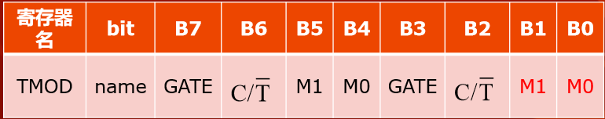

# 单片机第8课——定时器中断
#### <p align="right"> 作者：米米糊</p>
#### <p align="right"> 归档人：HITLYT</p>
## 前言
由于一些小失误，51单片机教程的定时器中断部分有两个版本，童鞋们不妨把两个版本都看一看，互相参考进行学习。
## 上集回顾~~
### 数码管
如何偷懒（封装一个数码管驱动）
### 再探C语言
C语言子函数
## 本集预览~~
### 中断
+ 什么是中断
+ 中断的好处
+ 复习外部中断
### 定时器中断
+ 定时器中断的使用
+ +1s的时钟
## 时钟
这次我们来说说时钟。

晶振为我们的单片机提供了一个固定的时钟信号。时钟信号在单片机内部就是一个个的方波信号。


所谓分频，就是让时钟的频率减慢。


假设单片机输入的时钟是24MHz
+ 请问，12分频后的频率是多少？

<p align="right"> 答案：2MHz</p>

+ 那么，分频后对应的周期是多少？


## 延时
回忆一下之前的延时
+ 采用空循环来浪费时间，效率低
+ 比如，希望让一个灯一秒钟闪烁一次，那么在等待的过程中CPU不能干任何其他事情，只能等待……
+ 我们多么希望能有一个东西，不干扰CPU干别的事情，只是默默地计时，等到时间到了指定时间，就跑过来提醒一下CPU该放下手头的事，让灯闪一下了……
+ 它就是——定时器（计数器）
## 溢出（纠正之前的一个错误~~）
（其实也不能叫纠正……因为在开始的时候有些东西理解起来比较费力，所以只能用错误的方法来表述，才能易于理解，随着学的东西多了，理解能力强了，就可以开始接受正确的解释了~~）
+ 一个unsigned char 类型的变量，最大值是255，那么，如果让他再加1，变量里的内容会变成多少呢？ 
+ 之前告诉大家说：千万不要超过255，否则会变成“乱码”……那么，究竟会变成什么呢？不是乱码！是一个确定的数！
```
unsigned char a;
```
当a=255时，即a=0xff时，其对应的二进制应该是
```
11111111
```
把这个数加1，列一个竖式看看~~


得到的结果需要用9位（bit）二进制数才能保存，但是a这个变量只有8位的存储空间，所以，丢掉最高位，只要低8位。所以，最后得到的结果是0。
```
unsigned int a;
a=0;
a=a-2;//减完后a的值是？
```


再来给难点的
```
unsigned char a;
//注意,这次a是有符号的
//提示：8为有符号数的范围是-128~+127
a=127;
a= a + 1；
```


做加法之前，a的符号位是0，表明这是一个正数~~

可是，加完之后，由于进位了，a的符号位成了1，竟然变成了负数……

那么这个负数究竟是多少呢？以后会学到，负数是用补码表示的~~用“取反加一”的口诀获得它对应的原码，应该是：
```
1000 000
```
对应的十进制数是128，由于这是一个负数，所以最终答案是-128

以上这些折腾人的东西就叫做

**溢出**

绝对的双刃剑！！

把溢出用好，可以在一定程度上简化程序，并且在硬件中很多功能都是基于溢出来实现的。但是，用不好的话，程序会出大问题，很多软件的安全漏洞（比如windows操作系统的）都是由于溢出引起的……
## 寄存器
### 两只水桶
为了揭开定时器的真面目，先认识两个水桶~~

**TH0和TL0**

TH0和TL0都是8位的寄存器（理解为变量就好），两个8位的定时器共同组成了一个16位的定时器

当TL0计满0xff后，再加1会导致低位溢出，产生的进位将进入到TH0，即TL0每溢出一次，TH0就加 1


当TH0和TL0都是0xff之后再加1，会导致低位的TL0向高位的TH0溢出，但由于高位也已经满了，故高位会再向前溢出，结果，导致TH0和TL0同时回到0x00


当TH0溢出或者TL0溢出的时候，便可以让它们通知单片机产生一个中断。那么，究竟是在TH0溢出时产生中断还是在TL0溢出时产生中断呢？这是可以通过编程来设置的~~

如果我们可以让TH0和TL0以固定的速度加1，那么就可以控制TH0和TL0的溢出速率了哦~~换而言之，就是可以控制多长时间让定时器产生一个中断。

还记得刚才讲的分频吗？

TH0和TL0每过12个时钟周期便加1，就是说，定时器的计数频率是晶振频率的十二分频。

之前计算过，24MHz的频率经过12分频是2MHz，对应的周期是0.5μs

如果想定时10ms，应该怎么办？


我们希望定时器每计数20000次便产生一次溢出

所以，不能从(TH0,TL0)=0x0000开始计时，而要从某一个初值开始计时

+ 一个16位的计时器，可以表示的数字是0~65535
+ 单片机在从65535溢出到0的那一刻引发中断
+ 为定时10ms，我们需要在第20000次加1的时候溢出
```
65535 - 20000 + 1 = 45536
```
+ 45536转换为16进制是0xB1E0（16位）

故它的高八位应该是0xB1,低八位应该是0xE0

即
```
TH0=0xB1;
TL0=0xE0;
```
其实不用算的，我们有小工具


### TMOD寄存器


+ M1、M0的不同组合可以让定时器工作在4种不同的状态下，我们只介绍两种，其余两种有兴趣自学~~
+ C/T后面再讨论~~
+ GATE位暂时不予讨论，通常置0，有兴趣自学~
+ 自学方法：芯片数据手册（Datasheet）和百度、Google、BY2HIT论坛……

+ M1=0 M0=1  16位定时器
+ M1=1 M0=0  8位自动重装定时器
+ 由于TMOD寄存器不可位寻址，所以不能在程序中写类似M1=xx;之类的语句，必须对TMOD做整体修改。
### TCON寄存器


+ TR0和TR1是开启定时器的开关，当TR0=0时，定时器0不计数，TR0=1时定时器才计数。TR1同理。
+ TF1、TF0、IE1、IE0涉及到中断更深入的东西，之后讲解。
+ IT0和IT1~~ 还记得他们吗？之前使用过，现在知道他们的出处了吧~~
+ TCON是可以位寻址的，故可以直接写类似TR0=1；
## 使能
还记得上节课讲的使能吗？

**第一道门：每个中断各自的门**
+ EX0      外部中断0的使能 
+ ET0      定时器0中断的使能
+ EX1      外部中断1的使能 
+ ET1      定时器1中断的使能 
+ ES        串口中断的使能

**第二道门：所有中断的总控制门**
+ EA    总中断使能

下面继续讨论如何实现一个10ms的定时程序。
+ 为了让定时器0工作在16位模式下，对TMOD进行设置
```
TMOD=0x01;
```
+ 要开启定时器0的中断使能，对ET0进行设置
```
ET0=1;
```
+ 要开启总中断使能，对EA进行设置
```
EA=1;
```
+ 让定时器开始定时，对TR0进行设置
```
TR0=1;
```
## 程序
完整的开启定时器的程序就应该是这样婶儿的~~
```
TH0=0xB1;//初值的高位
TL0=0xE0;//初值的低位
TMOD=0x01;//16位计时器
EA=1;//开启总中断
ET0=1;//开启定时器中断
TR0=1;//启动定时器
```
貌似很复杂的样子，不过多练练就熟悉了。

另外，传统的51单片机定时器输入时钟是晶振的12分频，但是我们这一单片机款也可以设置成不分频，有兴趣自学~~

现在，让我们通过中断来实现每隔1秒，让不同位数码管亮起的效果。

在这里新添加一个变量t，同时可以删除Delay500ms这个函数，本程序中不使用该函数。

并且删除掉原来while循环中的其他语句，只保留while(1); 

(注意while(1);后面有分号)
```
unsigned int t=0,i=0;
void main() 
{
	timer0_init(); 
	while(1);
}
```
添加初始化定时器的有关代码，并且删除掉原来while循环中的其他语句，只保留while(1);
```
void timer0_init()//定时器0的初始化，函数名随便起
{
	EA=1;//开启总中断
	TH0=0xb1;//初值的高位
	TL0=0xe0;//初值的低位
	TMOD=0x01;//16位计时器
	ET0=1;//开启定时器中断
	TR0=1;//启动定时器
}
```
下面要写中断服务函数啦，定时器0对应的是interrupt1

|中断查询号|中断类型|
|:--:|:--:|
|0|外部中断0|
|1|定时器0|
|2|外部中断1|
|3|定时器1|
|4|串口|

中断查询号在这里查找哦~~

添加定时器0的中断服务程序
```
void T0_Service() interrupt 1
{
	t++;
	if(t==100)
	{
		t=0;
		P0=P0>>1;
		i++;
		if(i==4)
		{
			i=0;
			P0=0x08;
		}
	}
}
```
注：由于定时器的TH0和TL0计满也不能到1000ms，所以我们另外增加一个计数器t，每隔10ms则t加1，t加满100则认为计满了1000ms。

因此就是这样一个结构
```
unsigned int t=0,i=0;
void main()
{
	void timer0_init();
	while(1);
}

void T0_Service() interrupt 1
{
}
```
**运行程序，观察效果**

+ 大家应该会发现，确实在计数，但是……计数貌似很慢啊，完全不是我们预想的1秒钟啊…… 
+ 原因出在哪里？
## 重装
**关于TH0和TL0重装问题**
+ 我们在初始化定时器参数的时候写了TH0=0xB1，TL0=0xE0，目的是让计数到达20000次（即10ms）时产生中断
+ 但是，在第一次产生中断之后，TH0和TL0由于溢出，均已变为0
+ 所以，第二次及以后的每一次计数都是从0开始计数的，直到计数达到65536次之后才产生下一次中断，而不是我们预想的20000次
+ 所以，要在中断服务程序中重新填充TH0和TL0。

在中断服务程序中添加重装语句


重装一般写在中断处理程序的开头。如果把重装写在中断处理函数的结尾，那么要等到整个中断处理函数执行完之后才进行重装，执行中断处理函数的时间将被累加到计时的时间中，造成误差。
### 16位自动重装的精确性讨论
**（以下内容有个了解即可，有兴趣可以深入学习~~）**

实际上，从中断发生到开始执行中断处理程序的第一行语句之间发生了很多事情，如果查看C语言编译后生成的汇编代码，你会发现这中间发生了包括**保护现场**、**压栈**、**长跳转**等等操作，只是这些工作编译器自动帮我们完成了，我们不必去了解它是怎么实现的。

但是所有这些操作都是会占用时间的，也就是说，从定时器溢出开始算，到执行我们的第一行代码【 TH0=0xB1; 】，中间一定会差上几微秒的时间。所以，这种定时方式不适合要求精确定时的场合。

### 8位自动重装模式
+ 当把定时器选择为8位自动重装时，定时器只有TL0参与计数 
+ 当TL0发生溢出时，单片机通过硬件把TH0中的数值复制到TL0中，这个操作几乎是瞬间完成的。
+ 这样，TL0马上就可以由新装入的初值开始计数，而不是从溢出后的0开始计数，精度大大提高。
+ 但是，定时器由16位缩减到8位，最大的定时时间会缩短。

修改程序为8位重装模式


将TMOD修改为0x02，这样就设置了定时器工作在8位自动重装模式下

回忆TMOD寄存器：



由于此时计数最大只能计到255，我们不妨让定时器每计250个数便产生一次溢出，也就是每隔
```
250×0.5μs=125μs
```
产生一次溢出。在这个设定下，计满1秒钟需要溢出8000次。

定时器初值应该设置为： 
```
255-250+1=6
```
在这里修改初值为0x06


由于现在要累计满8000次，故t需要改变为int型。


这里，我们依然可以用工具


在中断处理中，删除有关重装的两行程序，同时修改t的计数值为8000。


下载并执行，观察效果~~

## 把定时器变成计数器
从前面的介绍可以看出，定时器之所以能够定时，是因为它可以按照固定的速度来计数，所以从本质来说，定时器本身是一个计数器。

那么，如果把TH0和TL0的计时脉冲输入从晶振时钟信号改为某个引脚，是不是就可以对这个引脚上的高低电平变化计数了呢？

没错！就是这样！


+ 再看这里，C/T这一位就是用来选择是工作在计数器模式还是定时器模式的~~
+ C：counter   T：timer
+ 由于T上面有一条横线，表示这一位是0的时候选择为Timer模式，C上面没有横线，表示这一位是1的时候选择为Counter模式。


这里的T0和T1分别表示这两根引脚可以作为计数器的输入引脚~~他们对应的是开发板上的这两个按键。

计数器的使用和定时器的使用方法完全一样，只是定时器的+1信号来自于晶振时钟，而计数器的+1信号来自于某个引脚的输入。

有用到定时器的话可以继续自学一下，这里就不给出例子了哦~~

自学方法还是一样的~~

datasheet、百度、google、QQ群……
+ 题外话——说了这么半天，datasheet是什么啊= =
+ Datasheet就是数据手册的意思~ 每款芯片都有它的数据手册，咱们单片机的数据手册在这个位置：新会员资料/STC12C5A60S2.PDF
## 原理
TF1、TF0、IE1、IE0还有大家下一次会遇到的RI和TI他们都叫做“**中断标志位**”
### 为什么要有中断标志位呢？
+ 曾经，有很多中断标志位摆在CPU面前，CPU会每隔一段时间（12个时钟周期）去查看一次他们的状态，如果有哪个标志位被置1了，并且没有高优先级的中断正在执行，那么CPU就会把程序跳转到对应的中断服务程序去执行……
+ 我们之前所说的“触发中断”，无论是外部中断还是定时器中断，实际操作都是硬件把对应的中断标志位置1。如果你在程序中写一个IE0=1;那么也可以通过程序人为触发一个“外部中断0”，不信自己写程序试试~~
+ 大多数的中断标志位都会在跳转到中断服务程序后，由硬件自动清0,(如果不清0，下一次CPU过来巡视的时候，发现这一位还是1，就又会再触发一次中断的), TF1、TF0、IE1、IE0都是可以自动清0的。
+ 但是，也有特例，比如接下来要讲的串口中断，RI和TI标志位是需要在接受完数据后手动清0的。

刚才定时器说了那么多……其实可以用一 张图来表示，下面给大家一些图，是从 datasheet里中摘取出来的……大家试试~如果 能看懂这些图的话~~那就太棒了！


## 课堂练习
运用数据手册第47页，关于中断寄存器的表格，写一个程序，使：
+ 数码管用定时器1，每秒增一，20个一循环
+ Led运用定时器2，每两秒变换一次，实现二进制进位（0000 0000，0000 0001，0000 0010，0000 0011……）

**中断服务程序的格式**
```
void 函数名() interrupt 中断查询号
{
	//这里写程序
} 
```
|中断查询号|中断类型|
|:--:|:--:|
|0|外部中断0|
|1|定时器0|
|2|外部中断1|
|3|定时器1|
|4|串口|

中断查询号在这里查找哦~~
## 挑战任务
+ 基本功能：用数码管做显示，设计一个可以显示秒和分钟的电子表。

+ 扩展功能：加入时间调节功能，自己分配A、B两个按键。第一次按下A键时秒对应的两个数码管开始闪烁，此时按下B键可以调整秒数（秒数+1）；再按一下A键，分钟对应的两个数码管开始闪烁，此时按下B键可以调节分钟数（分钟数+1）；再按下A键，退出调节模式；再按下A键，重复进入上述调节过程。

**如果你对自己有信心……**
+ 增加C键，调节时按C键可以减1。
+ 在调节时，每按下一次B或C键变一个数字，长按2秒以上不松开则自动快速调整。

+ PS：等大家学会液晶以后……就可以做一个真正的电子表了！包括菜单选择、年月日小时分钟秒的调整、闹钟、秒表、倒计时等等功能都可以实现。我们在大一下学期的时候用了不到一个月的时间，各自用不同的方法都实现了这些功能。程序在1500行以内。

如果大家实现数码管的电子表功能，会有奖励的哟~~

# 小“作业”
+ 中断有什么优势，为什么要引入中断？为什么中断从我们学习的微控制器到大型的计算器都起到不可或缺的作用？
+ 在上节课的小“作业”当中让大家做一个时钟计数器，请结合今天所学的定时器，做一个定时器吧！（注意这个定时器还是会偷走你的时间！+1s）


------The End


----
版权声明：

文章均由哈尔滨工业大学业余无线电俱乐部，技术部原创，转载请联系[BY2HIT技术部 zhaoyuhao@by2hit.net](zhaoyuhao@by2hit.net)