# 开发环境配置
### 讲解人：郭梓贤
--------------------
## 1、引言

我们希望单片机执行什么任务，就将能够解决问题的代码烧写进单片机中，单片机执行程序，达到我们的目的。那么，设计单片机程序这一非常重要的环节，我们如何操作呢？这就要用到51单片机C语言程序的开发环境。这次就是帮助大家在自己的机器上安装keil4。

- Note：大家在今后的学习中会遇到各种各样的软件，很多软件的安装和破解已经是家常便饭，所以大家在刚接触这些事物的时候，不要因为什么都看不懂而有畏难情绪，开始接触所有人都是比较迷茫的。

## 2、开始操作

所有需要的软件都放在“新生培训资料”中了，大家依据步骤采用即可。

+ **安装keil4并激活**

我们选择c51v951a.exe安装

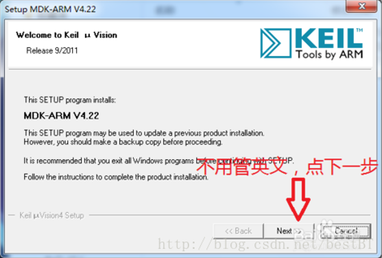

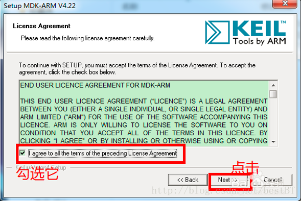

显然要agree啦（手动滑稽）

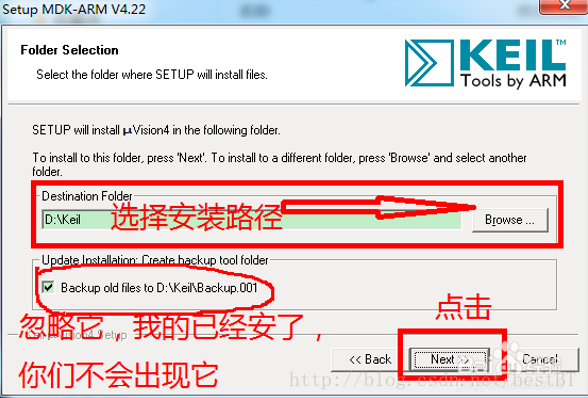

安装路径一定要全英文，不能用汉字，例如，D:\C51\keil 可以 D:\单片机\keil 不行

下面的不用管，那是二次安装时才会出的选项。

用户名随便写就好

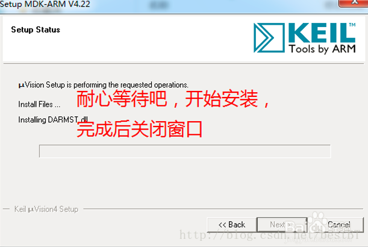

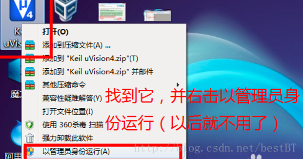

一定要用管理员身份运行！！！之后使用不需要以管理员身份运行

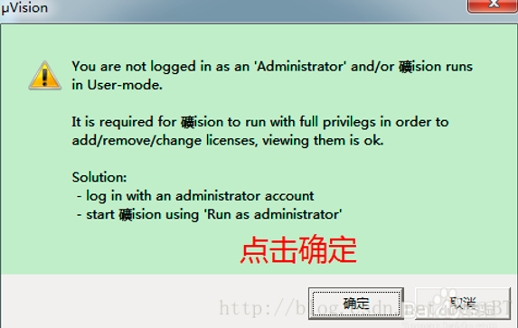

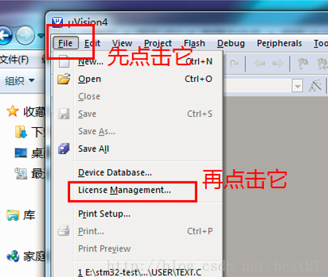

看到license（许可证），就知道下面要破解了吧（坏笑）

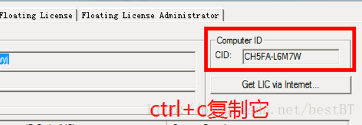

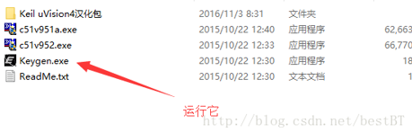

运行Keygen.exe

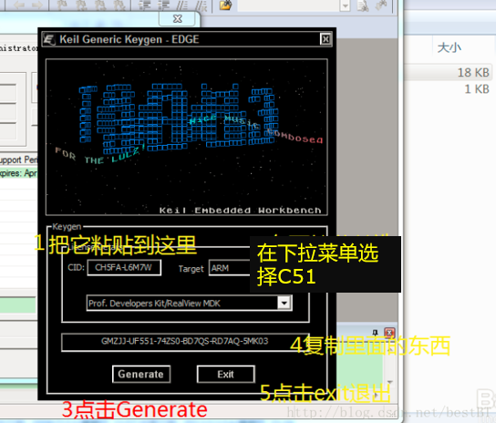

粘贴CID，下拉菜单选择C51，然后点击generate，产生激活码，复制它。

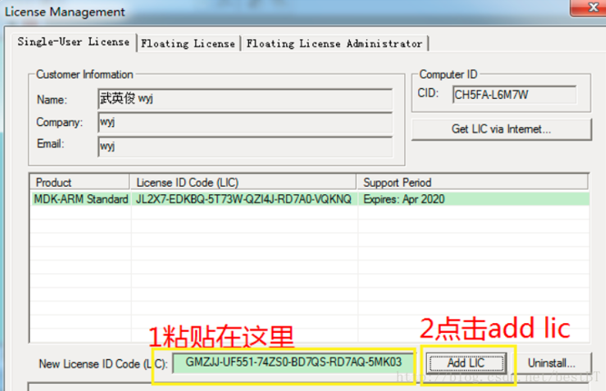

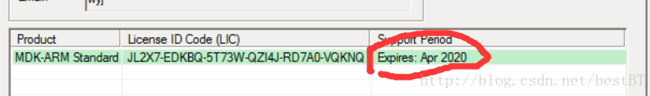

搞定

+ **安装下载版驱动程序**

写好的程序如何下载到单片机里呢？我们用下载版，将单片机与PC的USB接口连接，使用STC-ISP软件下载即可。

所以我们需要下载版驱动程序，来使电脑能够识别到咱们在USB接口插入了下载板。

**步骤**

找到新生培训资料里usb转ttl驱动文件夹，点进去

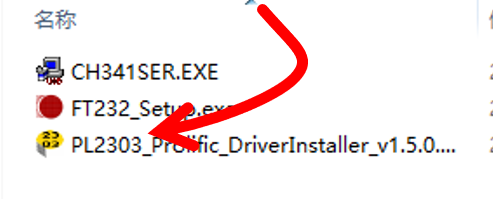

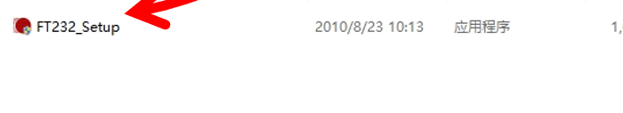

直接一路确定就OK了

**一个小小的问题**

PL2303会经常不好使，最初是产于国外，后来国内的芯片厂家也开始做，结果~为了打击盗版，厂家出的驱动程序里面就有了防盗版的措施，所以早期的驱动程序我们可以用，新版驱动就用不了。

然而，大家买到的PL2303绝大多数都是盗版（绝望.jpg），所以我们给大家的是旧版的PL2303驱动程序，保证大家能够使用。

然而实际上，windows对于PL2303是免驱的，自动给你配置了最新版驱动（2013版），而且windows又经常会把我们的旧版驱动自动更新成新版驱动。于是，我们的下载板就不能用了，你打开设备管理器就变成了这样。

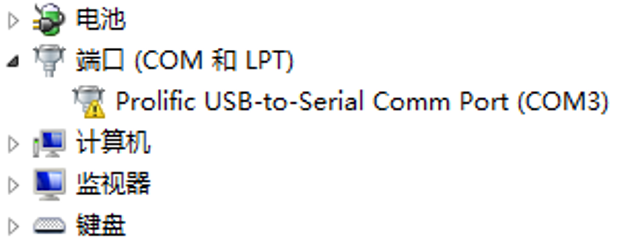

端口那里出现黄色警示小三角

解决方法很简单：

对它右键，更新驱动程序（实际我们想更新到旧版）

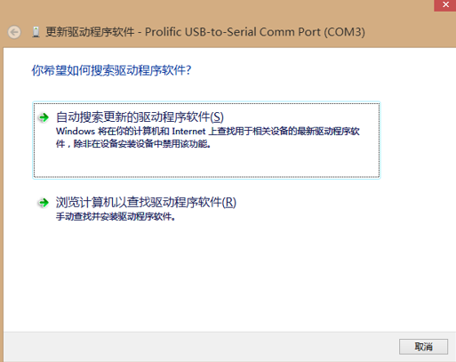

选择浏览计算机

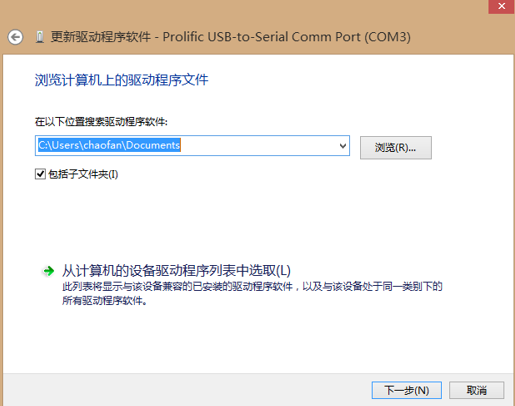

找到旧版的驱动程序，安装

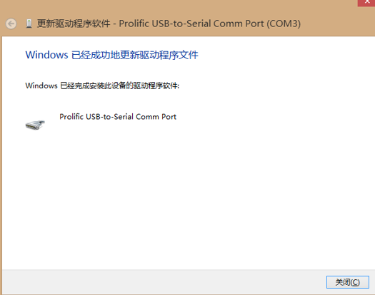

搞定

所以用PL2303的同学们，每当你发现下载板驱动有问题的时候，就重复一遍上述操作，习惯就好~~

**至此** 我们的开发环境配置完成了，如果大家遇到问题，可以自行解决或放到交流群讨论，如果实在凌乱，可以从新按步骤操作（重装大法好hhh）

祝大家顺利！
