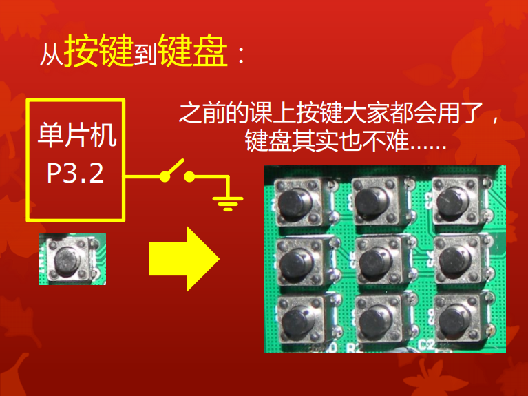
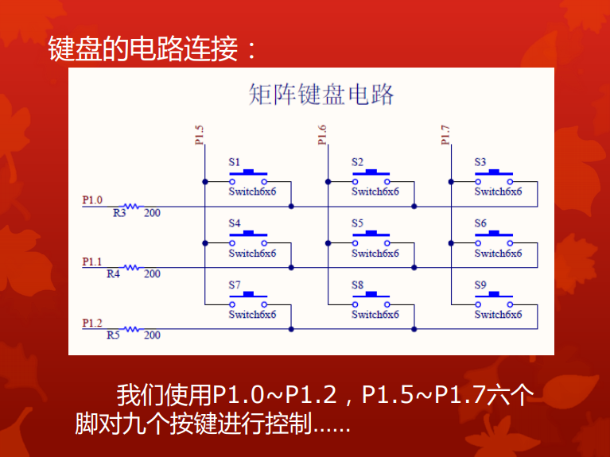
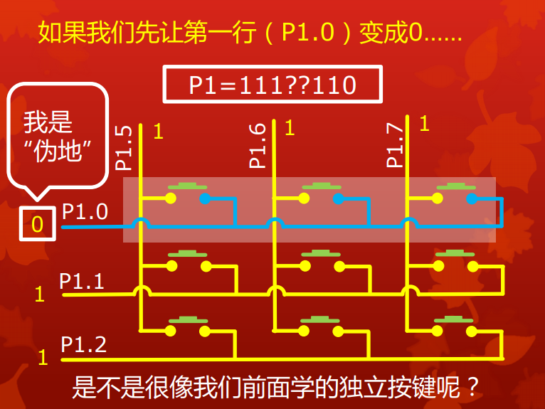
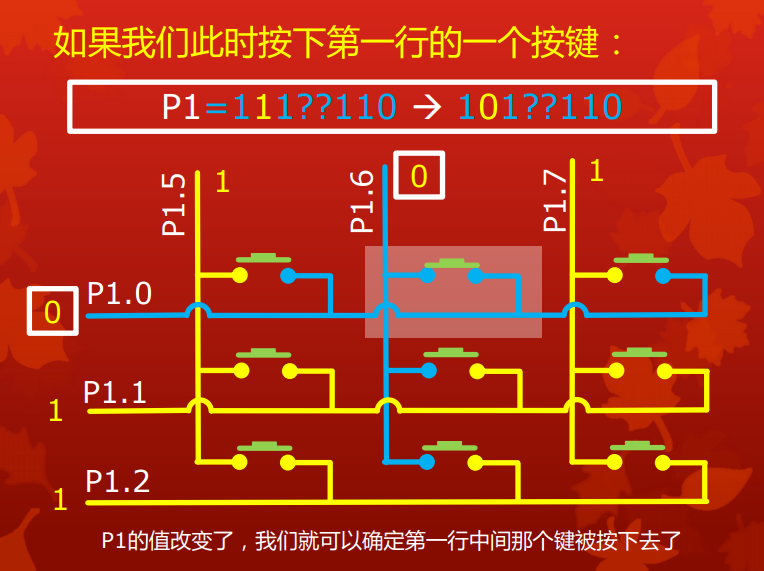
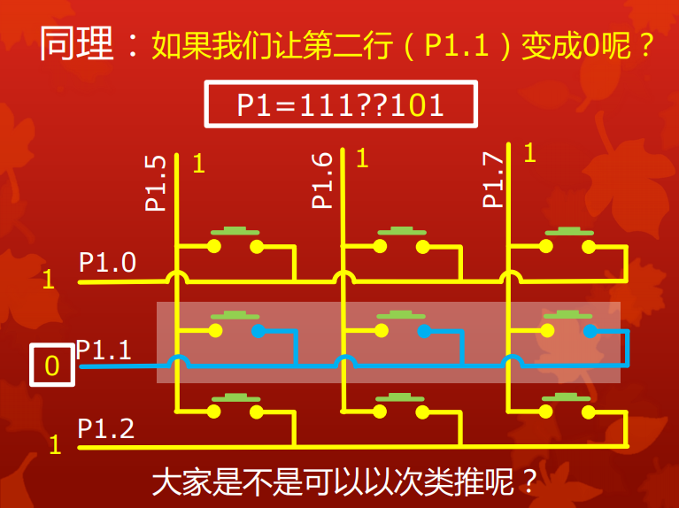
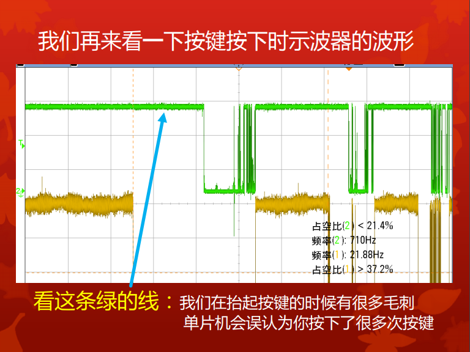

# 矩阵键盘
#### 讲解人：郭梓贤
------

### 1、引言

矩阵键盘，顾名思义，就是长得像矩阵的键盘，例如，电话拨号按键就是一组矩阵键盘，我们这一讲就是要通过51单片机实现这种随处可见的，用于人机交互的矩阵键盘。



### 2、关键词：

扫描IO口、按键的消抖
	
### 3、操作方法

在按键与外部中断一讲中，大家接触到了按键的基本结构，简而言之就是，按键的一边接地、一边接单片机引脚，当按键按下时，引脚电平由高变低，通过这种电位变化来得知按键被按下。

然而，对于一组矩阵键盘来说，涉及的按键往往很多，而单片机的IO口数量为数不多，我们希望尽可能节省IO口的使用，让单片机能做更多的事。所以对于矩阵键盘来说，我们显然不能每个矩阵键盘用一根线控制。

我们扩展板上有9个按键，组成3x3的矩阵键盘，我们板子布线的方式是，同一行共同接到一个IO口，同一列共同接到一个IO口，这样，算下来一共使用了6个IO口。为什么要这样设计？这与一个简单的数学规律有相同之处，同面积的长方形和正方形，肯定正方形的周长最短，而“周长”就好比我们使用的IO口数量，如果我们用1x9的方式，那么就需要10个IO口，而3x3就只需要6个。



那么问题来了，我们如何通过这6个IO口，得知每次这九个按键哪个被按下了呢？

设想这样一种情况，当我第一行P1.0的电位置0，此时我若检测到P1.5,P1.6,P1.7中的某个位置变成了低电平，那显然我们是可以确定哪个按键被按下了的。那么我们又如何顾及三行按键呢？答案是：扫描。

就像我们如果要让数码管显示几位不同的数字，我们只能每一次显示其中一位，通过单片机的高速循环显示以及人眼视觉暂留造成每一位都在同时发光的“假象”。这里，我们同样无法保证同时检测键盘每一行的情况，所以我们采用扫描的方式，将低电平在每一行高速循环，给人的感觉就是三行都持续进行着检测。图示如下：







而当我们按下一个按键时，高速的扫描会定格在我们按键的那一行为零的情形，然后通过单片机位处理我们就可以算出哪个键被按下。捕捉按键数值的代码如下：

```C

int getxy()
{
  for(w=0;w<3;w++)
  {
   P1=row[w];
   if(P1!=row[w])//按键导致P1数值发生改变
   {
    x=w+1;//找到所在的行
    switch(P1&0xe0)//分理出P1的高3位进行判断
    {
     case 0xc0: {y=1;} break;
     case 0xa0: {y=2;} break;
     case 0x60: {y=3;} break;
     default: x=0;break;
    }
    break;
   }
  }
  return 0;
}

```

上面的代码是矩阵键盘的核心部分，而我们得到了按键的数值如何得到体现呢？

我们用数码管体现出按键的反馈，所以，我们实现的功能是，按下矩阵键盘的某一个键，数码管显示对应的数值。全部的代码样例如下：

```C
#include <stc12c5a.h>
unsigned char num[10]={0x3f,0x06,0x5b,0x4f,0x66,0x6d,0x7d,0x07,0x7f,0x6f};
char row[3]={~0x01,~0x02,~0x04};//分别给P1.0,P1.1,P1.2置0，其他位置全1
unsigned char zheng[4]={0x08,0x04,0x02,0x01};//共阳数码管正极
char x,y;
unsigned int key=23;

void print();//数码管显示函数声明
int getxy();//按键检测函数声明

void main()
{
 P0M0=0XFF;
 P0M1=0X00;//开启推挽输出
 while(1)
 {
  getxy();//得到按键的行和列
  if (x!=0)
  {
   key=3*(x-1)+y;//计算按键的数值
  }
  else
  {
   key=0;
  }
  print();
 }
}

int getxy()
{
 for(w=0;w<3;w++)
  {
   P1=row[w];
   if(P1!=row[w])//按键导致P1数值发生改变
    {
     x=w+1;//找到所在的行
     switch(P1&0xe0)//分理出P1的高3位进行判断
     {
      case 0xc0: {y=1;} break;
      case 0xa0: {y=2;} break;
      case 0x60: {y=3;} break;
      default: x=0;break;
     }
    break;
    }
  }
 return 0;
}
void print()
{
 P2=~num[key];
 P0=0xff;
}

```   
 
其中关键的部分就是，通过扫描得到了按键的行和列，并且同过简单的数值关系推出按键的数值。

这或许对大家来说非常的简单，并且可能没有什么实用价值，那么我们实现一个更强的功能：模仿电话按键时的情形，按一个数，就在尾部多一个数。

需要多考虑什么因素呢？

首先，显示的四位数字不是相同的了，其次，每次按键都更新显示的数字。第一个问题我们在数码管一课中已经解决，那么更新数字这个问题可如下解决：

```C
num_=(num_*10+k)%10000;//每按下一个键更新一次要显示的数
```

实现此功能的全部代码样例如下：

```C             
#include <stc12c5a.h>
unsigned char num[10]={0x3f,0x06,0x5b,0x4f,0x66,0x6d,0x7d,0x07,0x7f,0x6f};//取反之后得到数码管负极
char row[3]={~0x01,~0x02,~0x04};
unsigned char zheng[4]={0x08,0x04,0x02,0x01};//数码管正极
unsigned char b[4]={0};//分离四位数所需数组
char x=0,y,r,k;
unsigned int i,j,yanshi;
long key,num_=3;

void print();
int getxy();//函数声明

void main()
{
 P0M0=0XFF;
 P0M1=0X00;//开启推挽输出
 while(1)
 {
  flag=getxy();
  if (x!=0)
  {
   k=3*(x-1)+y;
   num_=(num_*10+k)%10000;//每按下一个键更新一次要显示的数
   key=num_;
   while(getxy());//停留直到按键松开
   for(r=0;r<500;r++);//按键松开之后再延时一会，度过不稳定期，见下文详细阐述
  }
  print();
 }
}

int getxy()
{
 x=0;//把x清零
 for(w=0;w<3;w++)
 {
  P1=row[w];
  if(P1!=row[w])
  {
   x=w+1;
   flag=1;
   switch(P1&0xe0)
   {
    case 0xc0: {y=1;} break;
    case 0xa0: {y=2;} break;
    case 0x60: {y=3;} break;
    default: x=0;break;
   }
   break;
  }
 }
 return x;
}
void print()
{
 for(j=0;j<4;j++)//分出要显示的四位数
 {
  b[j]=key%10;
  key=key/10;
 }
 for(yanshi=0;yanshi<80;yanshi++)
 {
  for(i=0;i<4;i++)//循环显示四位
  {
    P2=~num[b[i]];
    P0=zheng[i];
    for(r=0;r<100;r++);//显示一位之后延时一会
  }
 }
}
```

其中，需要注意的是，这次数码管不是静态显示四位相同的数了，需要通过扫描每次显示四位不同的数。并且每次按下一个按键之后需要更新显示的四位数，key和num_选用long型是因为在单片机中int类型有两个字节储存空间，unsigned int最多能表示到2的16次方-1，65535，这样当一个比较大的四位数（如，99999）乘10的时候就会发生溢出，数据出现错误，所以用四个字节的long型数据，避免这种情况。

还有一点，代码注释中提到了消抖，如果不加用于消抖的延时，功能是无法实现的，因为，人的手动操作并不完美，松开按键的一瞬，单片机可以检测到多次按键操作，导致一次按键按出许多个相同的数，加入延时后略过了松开按键的这一段不稳定期，达到目的。从人按键过程的示波器图像可以看出，松开按键的过程中出现很多次的电位变化，消抖就是消去了这一部分的影响。




