# 电路板焊接学习笔记
#### 
 指导：
#### 
 作者：HITMechanic

## 文章概述
  锡焊是电路板制作中的必备技能，简单易学，本文为整合实践经验与网络资料的一篇学习笔记，主要介绍常用的点锡焊接法。  
  文章主要有三部分:物品介绍，焊接流程，注意事项。  

## 物品简介
### 必备
#### 电烙铁
  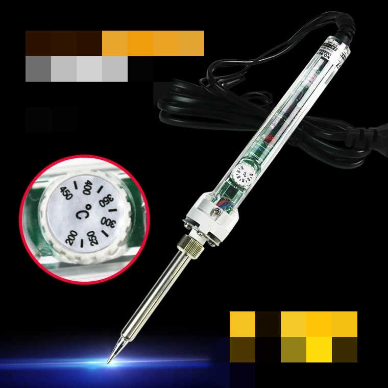  
#### 焊锡丝
  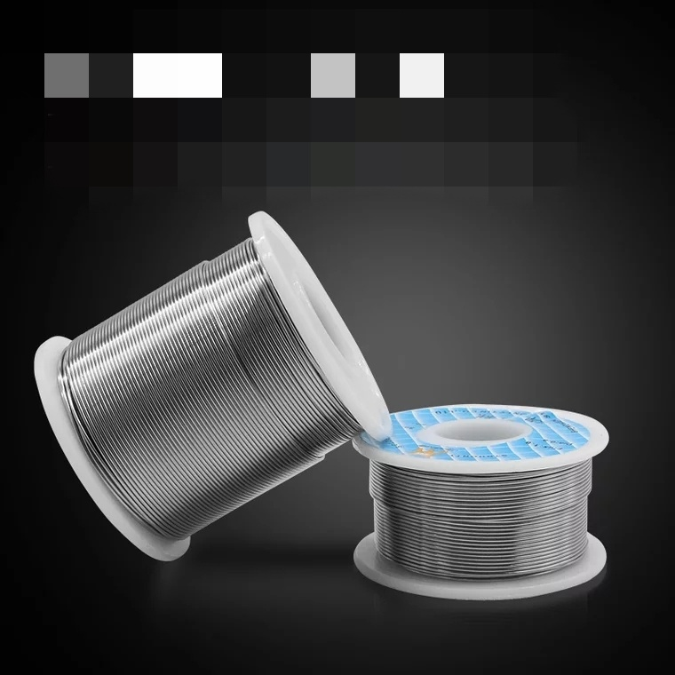
#### 电路板及一些焊件
  请注意电路板[^footer1]上的环形小洞——焊盘  
  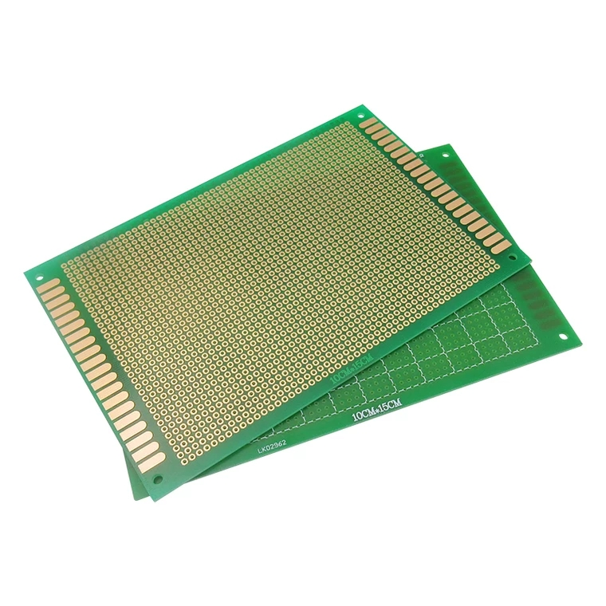  
  引脚（管脚）
  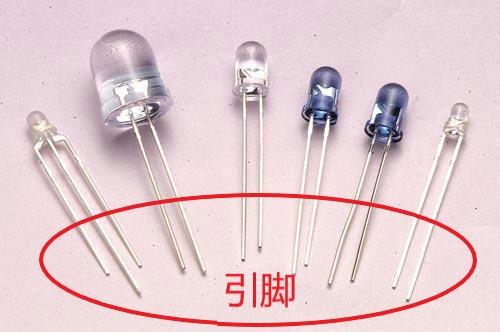
#### 各种钳子  
  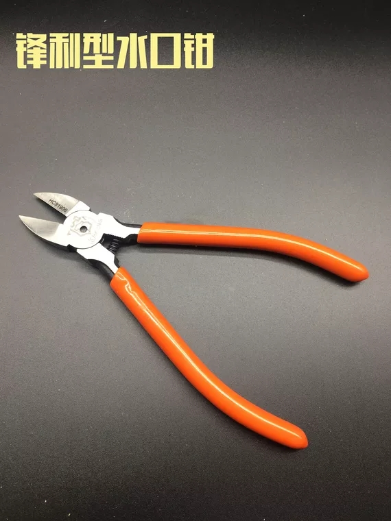  
  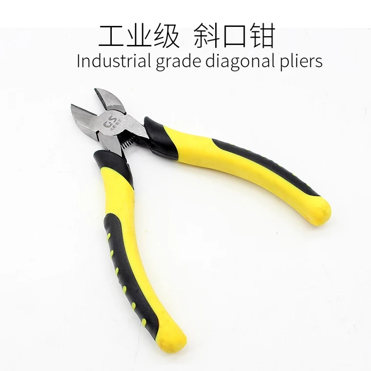  
  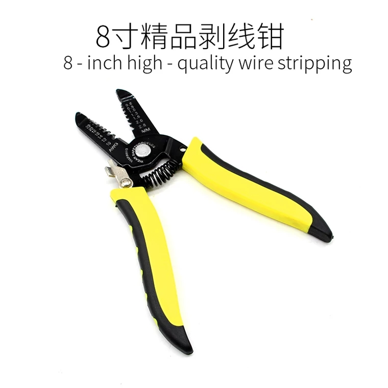  
  水口钳更锋利，原用于剪切塑料；斜口钳更适合剪断铁丝等硬物；在焊接时用途基本相同，不必特意区分。剥线钳可根据经济状况自行决定是否购买。  
### 选备  
#### 助焊剂（主要成分为松香）  
  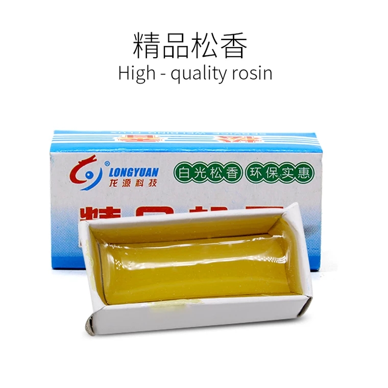  
  由于某些焊锡丝中含有助焊剂成分，故可根据实际情况选择使用  
#### 吸锡枪
  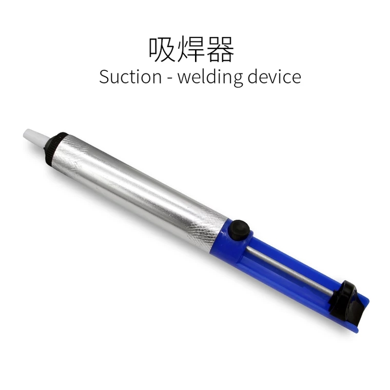  
  焊错时的补救措施，后文有使用介绍  

## 准备
  将物品准备好。如果烙铁头有黑色氧化物覆盖，先用挫或砂纸打磨干净，露出紫红色。焊盘和管脚上如果有氧化层也需用砂纸打磨干净。插电加热，待烙铁热后，惯用手以握笔姿势握电烙铁，另一只手捏住焊锡丝（留出适宜长度，防止烫伤），在烙铁头表面涂一层焊锡，在湿海绵上蹭几下。  
  ps：烙铁和焊锡丝的拿法不唯一
>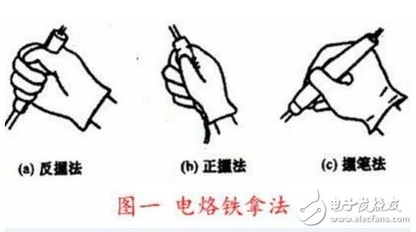
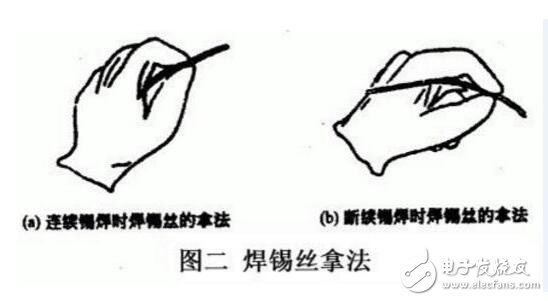

## 焊
0. 先将烙铁头在助焊剂内浸入一次（如焊锡中含助焊剂无需此步）；  
1. 将烙铁头最大面积地同时接触两焊件的焊接表面（焊盘和引脚），加热整个焊件面1～2秒；  
2. 将焊锡丝送向焊盘、管脚和烙铁头三者接触点处；  
3. 推动；
4. 当焊锡融化一定量之后，将焊锡丝向45º侧上方移开；  
5. 观察焊锡浸润的焊接部位，正常以后，向与水平45º斜上方移开电烙铁，结束焊接。  
  总结：预热，送丝，推丝，撤丝，撤烙铁  
>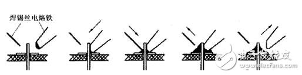

## 哎呀！焊错啦
  将烙铁贴在焊错的焊锡上加热几秒，待焊锡融化后将吸锡枪口对准焊锡，吸起，抬起烙铁  
    

## 焊接效果判断  
  焊点应呈正弦波峰形状，表面应光亮圆滑，无锡刺，锡量适中。  
  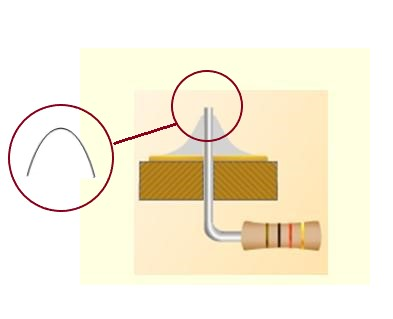  
  当然，一般这样就行  
  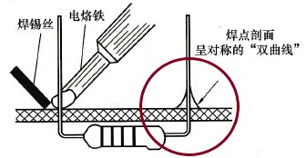  

## 注意事项
### 1. 物品摆放:不需要特别整齐，但要 *安全、顺手* ；  
### 2. 流程中有 *两个预热* ，准备阶段预热是为了把烙铁加热到高于锡熔点的温度，焊接阶段预热是为了焊锡与焊盘、管脚更好接触，注意区分；  
### 3. 电烙铁用后归架，烙铁头不要碰到电线和桌面，最重要的，*别碰到自己*；  
### 4. *通风* , 且烙铁离鼻子的距离应不小于30cm（焊锡熔化时会产生少量有气味的气体，长时间接触对身体有害）；
### 5. 烙铁 *插电时间不要过长* ，避免加速烙铁氧化；  
### 6. 烙铁在焊盘上 *停留时间不要过长* ，防止焊盘脱落；  
### 7. 烙铁 *用前去除氧化层，用后涂锡保护*。  

  烙铁使用方法因人而异，只要安全且习惯即可，锡焊技术不难，久练久熟。

  --END  

  本文主要以介绍焊接流程为主，具体名词解释可参考如下链接  
  [电烙铁](https://m.baidu.com/sf_bk/item/%E7%94%B5%E7%83%99%E9%93%81/1470787?ms=1&rid=8315970452228889092)  
  [电路板](https://m.baidu.com/sf_bk/item/%E7%94%B5%E8%B7%AF%E6%9D%BF/10106124?fr=aladdin&ms=1&rid=8126157834511445102)  
  [焊盘](https://wapbaike.baidu.com/item/%e7%84%8a%e7%9b%98/2167265?fr=aladdin&ms=1&rid=8329528217385613928)  
  [焊锡丝](https://wapbaike.baidu.com/item/%e7%84%8a%e7%9b%98/2167265?fr=aladdin&ms=1&rid=8329528217385613928)  
  [吸锡器](https://m.baidu.com/sf_bk/item/%E5%90%B8%E9%94%A1%E5%99%A8/737071?fr=aladdin&ms=1&rid=8457550279080721797)  

  教学视频推荐：  

  [电路板焊接教学](http://m.iqiyi.com/w_19rumw52cp.html)  

  参考资源链接  
  [在家如何自己焊接电路板](http://k.sina.com.cn/article_6450260637_180772a9d001009rab.html)  
  [怎样对电烙铁焊好的焊点质量进行检查？](http://www.aitmy.com/news/201601/26/news_112244.html)  
  [锡焊接技术的五步法](http://www.elecfans.com/article/89/140/2017/20171213602977_a.html)  
  [带锡焊接法](http://www.51dzw.com/embed/embed_81012.html)    

   [^footer1]: 此电路板又称万用板，常用于练习和简单电路制作。这个脚注就是为了加脚注加的脚注:-)

#### 
 时间：2018.09.26

----
  版权声明：

  文章均由哈尔滨工业大学业余无线电俱乐部，技术部原创，转载请联系[BY2HIT技术部 zhaoyuhao@by2hit.net](zhaoyuhao@by2hit.net)
