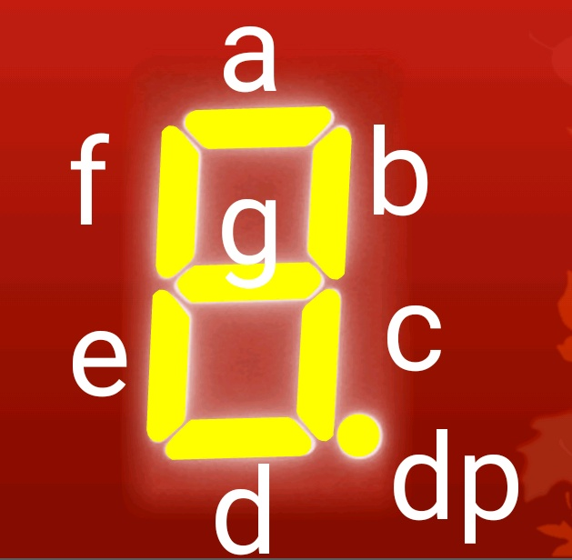
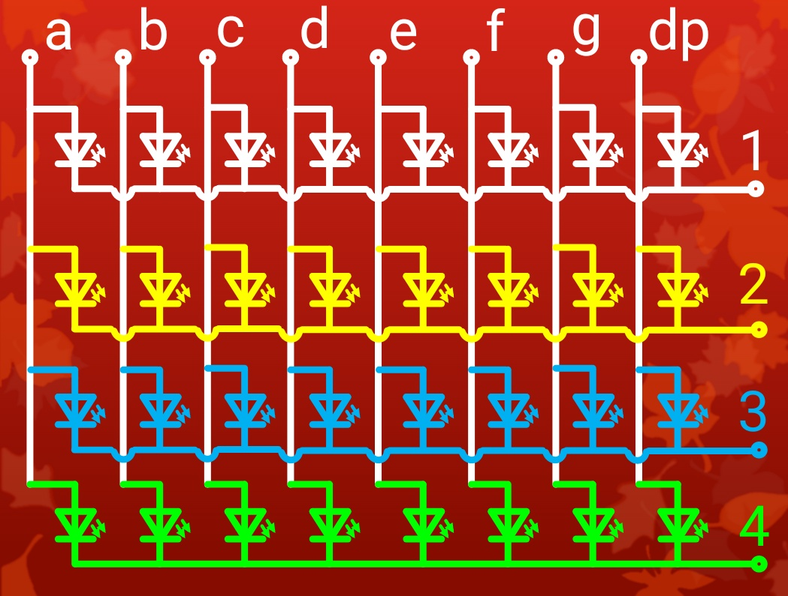
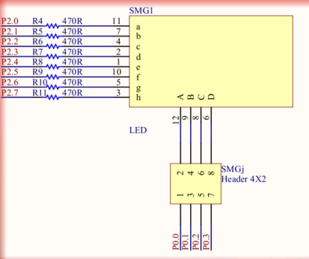
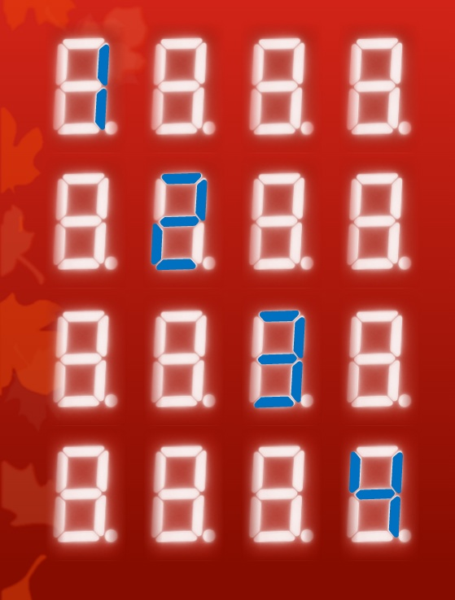
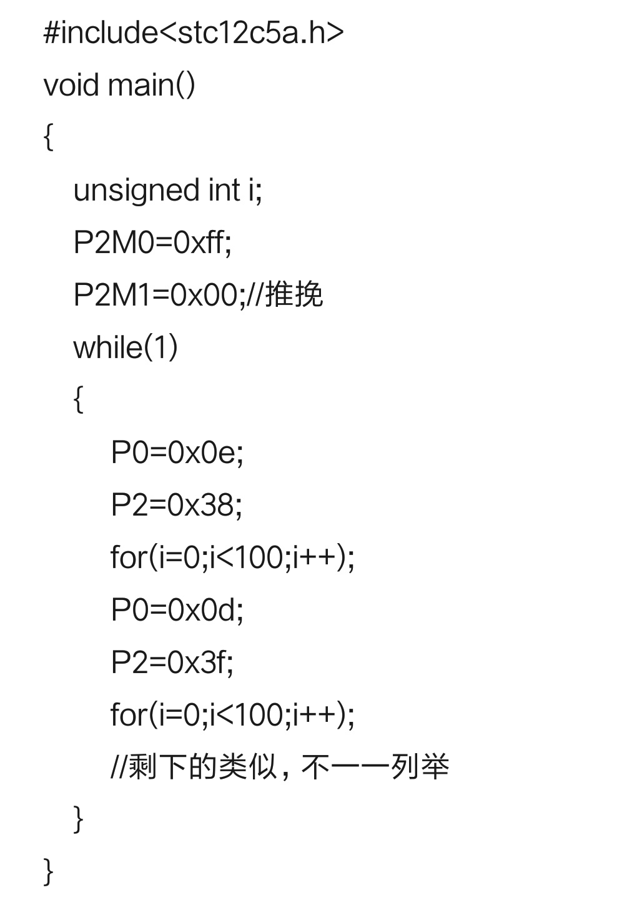
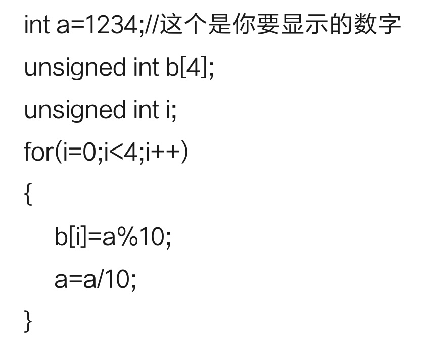

---
##关于数码管部分的小总结

###目录
######1.什么是数码管
######2.如何让数码管亮起来
######3.如何让数码管显示不同数字
######4.让数码管显示一个变量的值
######5.一些其他的东西

####1.首先我们要知道什么是数码管
######数码管就是显示数字的小玩意
######种类分为共阴数码管和共阳数码管
所谓共阴就是阴极连在一起，共阳就是阳极连在一起。
######数码管的每一个笔画叫做一段，每一段还有一个英文名字

####2.那我们要如何让数码管亮起来呢
我们用的是四位八段数码管，那么控制他们我们需要多少个引脚呢？4*8+4=36个？nonono,太浪费了
但如果我们这样做

就只需要8+4=12个引脚就可以达到控制数码管的目的
好，我们先让数码管同时显示数字1

这是共阴数码管芯片图(程序中共阳数码管只需按位取反就行了)
为了显示数字1，P2.7到P2.0分别为00000110
即0x06，同时为了让四位都亮起，P0应为xxxx0000,为了方便我们让P0=0x00
##代码引用

###### #include<stc12c5a.h>
###### void main()
###### {
######    P2M0=0xff;
######    P2M1=0x00;//推挽
######    P2=0xff;
######    P0=0x00;
######    while(1);//循环
######}
####3.那么我们怎么让数码管显示不同数字呢
实际上数码管和流水灯类似，以一种我们叫他动态扫描的方式运作，so一个主意产生了，如果我们让数码管第一次只亮第一个数字第二次只亮第二个数字，一直到第四个数字之后再循环到第一个数字，就像

如果进行快速的扫描就会有各位数字不同的效果了，同时如果我们给显示每一位数字的一段代码套上for循环的话我们就会看到延时的现象

##代码引用

#####那么现在问题来了如果一直这样一个一个写好麻烦，有没有什么稍微方便一点的工具呢？
######有的有的
#####用一个数组就可以了
只要把每个数字对应的16进制数存入数组中，用的时候直接对数组操作就可以可。
#####我们已经能够让数码管显示我们想要的数了，但是还不是很方便，怎么能够输入一个数就显示一个数呢？这也是我们要思考的。
####4.让数码管显示一个变量的值
实际上我们要显示一个四位数，可以把它的四个数拆开分别存到一个数组中之后再加上数码管显示的功能就能够达到我们的目的
######想法已经有了，那就开始操作
######如何将一个四位数分成四个数呢？
我们要用到两个运算符
###求余      ％
###除法     /
######就是他们两个
比如说1234对10做求余得到的就是4，对10做除法再对10做求余得到3，之后类似得到1，2，3，4再存入数组就行了
##代码引用

####5.一些其他的东西
关于数码管显示的东西初步已经说的差不多了
其余的就是想稍微说一下
###### **关于写个显示love的代码**
这个和显示数字一样，用16进制表示love即可
######   **关于写个滚动显示iloveyou 的代码**
其实也不是很难，就把每次要显示的表示出来并存到数组中，取数，延时，取数，延时，没错用一个for循环就行了
######    **关于函数**
如果你发现一段代码你会经常用，那么不妨把它封装成一个函数，声明之后，在主函数中调用就行了，很方便
#####希望能有点用吧~

