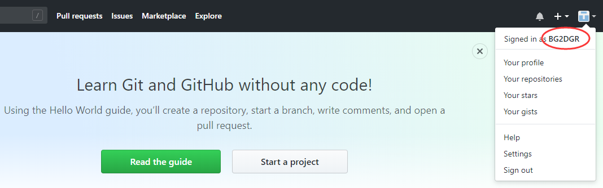
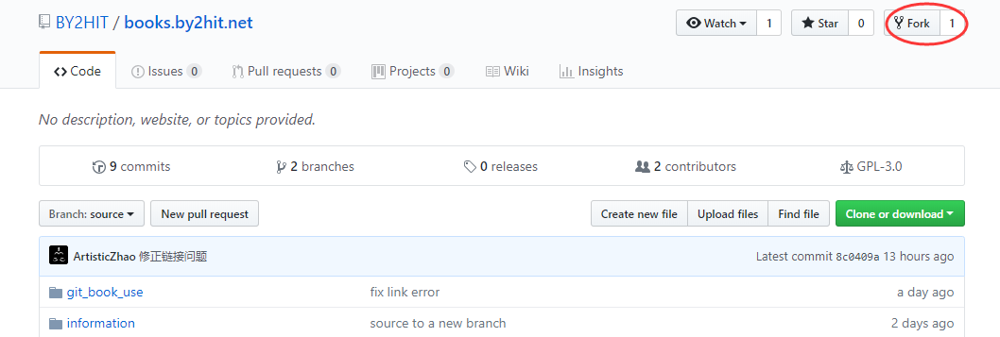
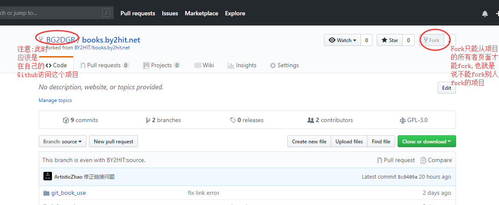
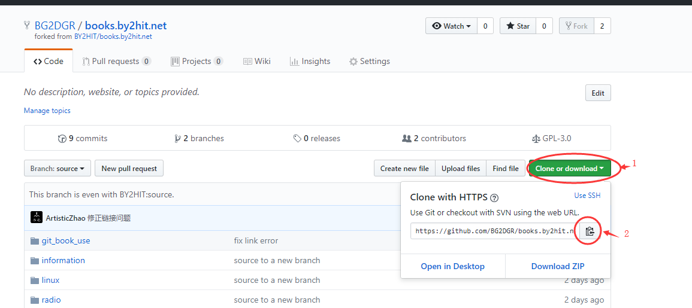
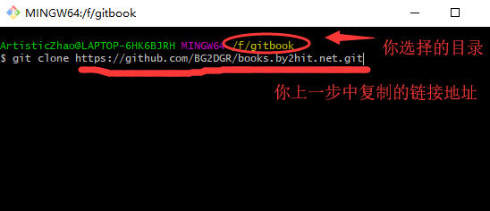
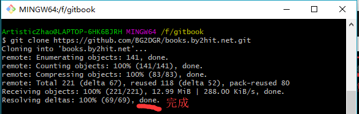
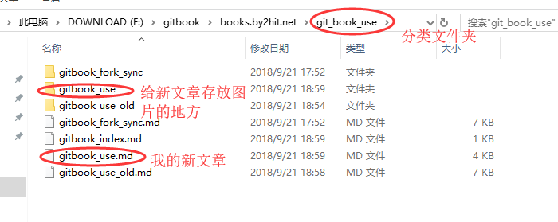

Title         : 接入books.by2hit.net的开源创作平台
Author        : BG2DGR
Logo          : false

[TITLE]

# 简介 

[books.by2hit.net](books.by2hit.net)是哈尔滨工业大学业余无线电俱乐部一个为会员开放的创作平台,用以创作更多的原创内容.

# 注意事项

* 项目托管在Github平台,一切开源
* 内容包括但不限于:业余无线电相关内容,电子电路,互联网技术等
* 内容由俱乐部管理层人员审核 
* 遵循[GNU General Public License v3.0](https://github.com/BY2HIT/books.by2hit.net/blob/source/LICENSE)

# 如何接入

## 准备工作

* 注册[Github](https://github.com/)账号  
就像这样:

* 确保Git已被安装  
这里假定你已经安装了[Git软件](https://git-scm.com/),安装可以参考文章:[Git安装教程](https://www.jianshu.com/p/414ccd423efc) 


## 准备写作环境

* 访问[BY2HIT/books.by2hit.net开源项目](https://github.com/BY2HIT/books.by2hit.net)并Fork  
项目地址:[https://github.com/BY2HIT/books.by2hit.net](https://github.com/BY2HIT/books.by2hit.net)  
点击fork之后,页面会自动跳转到你的GitHub页面,同时你的repo中就会出现刚刚fork的这个项目.**注意:**此时你fork的操作只是对源项目的当前时刻的状态进行复制,到你的repo之后,如果源项目更新,但是你的repo中的项目是不会更新的.解决办法请看TODO
 
* 获取你的repo地址  


* 在合适的位置打开git-bash,并clone repo 到本地  



## 开始创作
### 目录结构
```
├── book.json
├── CNAME
├── git_book_use
│   ├── gitbook_fork_sync(这是目录)
│   ├── gitbook_fork_sync.md
│   ├── gitbook_index.md
│   ├── gitbook_use(这是目录)
│   └── gitbook_use.md
├── information
├── LICENSE
├── linux
├── radio
├── README.md
└── SUMMARY.md
```   
文件略多,这里**仅**列出顶级目录,以及git_book_use目录中文件和目录.  
1. 目录文件--SUMMARY.md  
首先SUMMARY.md 是这个平台文章的总目录,如果你添加了一篇文章青注意在此**添加你文章的链接地址**,否则默认不会访问到你的文章.  
2. 内容分类目录
"git_book_use", "information", "linux", "radio"四个文件夹是分类目录, 不同分类的文章被保存在不同的文件夹下面
|目录名|内容|
|:-------:|:------------- |
|   radio  |业余无线电相关内容与知识|
|information|信息学相关的内容,如数据压缩,加密等内容|
|linux|linux操作系统的相关内容,包括一些开源社区|
|git_book_use|介绍代码管理平台git,以及本开源知识库的用法和注意事项等|
|...|更多内容等待你来添加|
3. 文章文件  
上文目录中列举出的gitbook_fork_sync.md,就是一片文章文件,他用[markdown语法](https://www.jianshu.com/p/b03a8d7b1719)编写而成.详细请点击链接.  
4. 图片目录  
文章中全是文字是单调的,就如这篇文章,就使用了大量图片, 请把图片放入中,引用方式之后会介绍.  
5. 子目录文件 *index.md  
在每个分类目录中,都包含一个\*index.md \(其中\*号内容同目录名\),注意在此**添加你文章的链接地址**

### 建立你的第一篇文章
选择一个目录,或者新建一个目录.


并开始用markdown写了一篇文章.

### 另:如何添加图片
请在图片文件夹中首先存入你的图片,然后在你的文章中写入类似
```

```
注意格式,小括号中,应该是"目录名/文件名"

### 提交你的文章
再提交之前,先要确认目录是否添加好.
在你刚刚的git-bash窗口中输入
```
git add .
```


