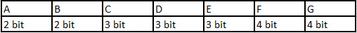

# 图像编码
#### 
 主讲：索拉

#### 
 归档人：郭梓贤

#### 
 时间：2018.3.27

人们希望更高效地利用储存空间，用有限的空间储存更多的信息。显然，储存所需的信息是以0、1数码的形式进行的，所以我们需要给出预先规定的编码方式。

理想的编码方式是在包含所有所需信息的同时，尽可能少占用空间，也就是储存下的数码尽可能的少。

分析一个简单的例子，假设我们需要储存由ABCDEFG构成的文章，共有100个字符。最容易想到的方法是用三位二进制数表示这7个字符，那么储存这篇文章就要用到300个数码，即300位。这种编码方式简单通俗，在文章中各个字符随机出现的情况下无可厚非。然而，遗憾的是，我们储存的信息往往具有一定的关联，全部用这种编码方式来储存，有时并不能使人满意。

比如，这篇文章仍然是100字符，但第1~6个字符为ABCDEF，7~100都是G。这种情况下使用上述无差别的编码方式就显得臃肿。但若采用下法：G-01、A-1001、B-1011、C-1100、D-1101、E-1110、F-1111，简化出现频率高的字符G的编码，总共只需212位，相比于300位来说少了许多。然而，应注意到的是，虽然简化出现概率高的字符编码方式能使空间占用减少，但是不能无节制地简化编码。上面的编码方式中如果G用1表示，那么1111就出现F、G的歧异，所以编码要有区分各个字符的手段。

香农范诺编码是一种体现上述思想的编码方式，根据信息中不同单元出现的频率而有区别的予以编码。香农还给出了计算文件信息量的办法——香农熵，如图1。香农范诺编码的具体操作过程如图2，首先将各种出现的字符排列一行，然后尽可能将其分为频率相差较小的两部分，左边的几个字符第一位统一为0，右边为1。然后对第一位为0的部分重复上述步骤直至完全编码，第一位为1的同理。

 $$H=-\sum P_i logP_i$$ 

对于表格中给出的概率，假设共100字符，则共需要274位。然而此法中仍有不完善的地方，例如：最初的排序中不能很好地保证结果最优。因此，在这种方法的基础上哈夫曼提出了另一种处理方式。仍以依据上述例子进行阐述，操作如下：取出所有字符中出现频率最低的两个，将其频率相加，并视为一个整体，然后从六个频率中抽出最小的两个相加，生成五个频率，以此类推，生成一个树状图。之后在树状图的分支上左侧记0，右侧记1。即得编码。上图。得到结果共需272位，可见哈夫曼编码比香农范诺编码有一定的改进。

然而，Jorma Rissanen提出的算数编码跳出了0、1数码编码的框架，跨越式地提高了编码效率。举例阐述：若文件中字符A的概率为0.1，B的概率为0.2，C为0.3，D为0.4。此时储存文件开头三个字符BDA，则操作方法为：将0~1的空间按比例划分为ABCD的区域，此例中开头字符是B，所以下一步将B区域再按比例分为ABCD四个区域，第二个字符为D，所以将D区域再按比例分为ABCD四个区域，记录最后这个A的区域中的任意数（图中阴影），即可记录BDA这个字符串，更长的同理。

人们常通过对编码方式的优化实现文件的压缩，而研究压缩主要研究信息的预处理，寻求信息之间的相互联系，进而找出合适的、高效的编码方法，使文件占用空间较小，达到压缩的目的。

----
版权声明：

文章均由哈尔滨工业大学业余无线电俱乐部，技术部原创，转载请联系[BY2HIT技术部 zhaoyuhao@by2hit.net](zhaoyuhao@by2hit.net)