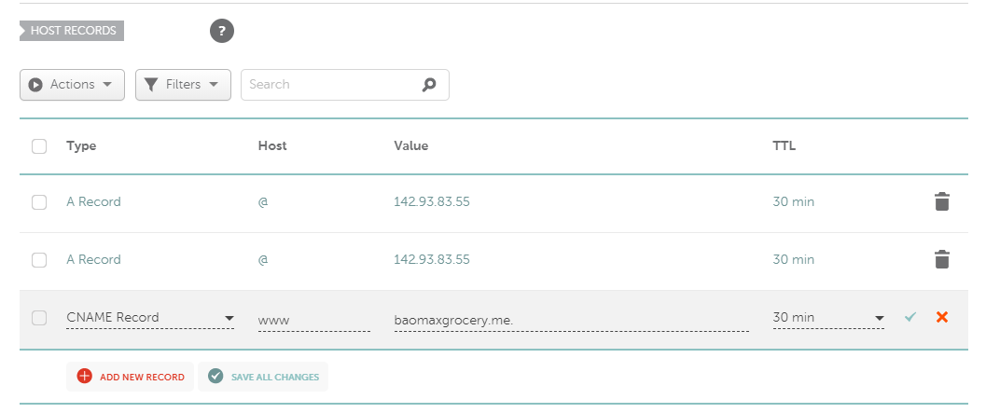
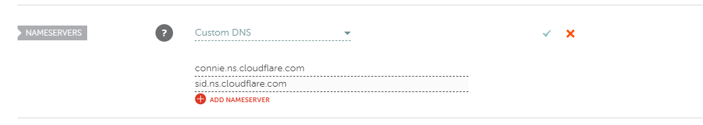

# 应用新的域名到CDN, 并开启TLS
#### <p align="right"> 作者：BG2DGR</p>

[TOC]

## 0x00 步骤

1. 购买域名
2. 设置DNS
3. 获取证书
4. 配置CDN

## 0x01 操作实现

### 1) 设置DNS

打开购买域名的管理界面, 进入DNS设置页面, 配置记录如下



等待域名的解析, 直到访问该域名解析到你的服务器进行下一步

### 2) 获得证书

[使用acme.sh获得证书]: https://ruby-china.org/topics/31983

```
# acme.sh --issue -d www.your-app.com -w /home/ubuntu/www/your-app/current/public
$ acme.sh --issue -d www.baomaxgrocery.me -w /home/zyh/blogs/public
```

如果出现`It seems the CA server is busy now, let's wait and retry. Sleeping 1 seconds.`提示信息, 那么需要更新acme脚本

```
$ acme.sh --upgrade
```

### 3) 安装证书

```
acme.sh --installcert -d www.baomaxgrocery.me \
               --keypath       /home/zyh/ssl/www.baomaxgrocery.me.key  \
               --fullchainpath /home/zyh/ssl/www.baomaxgrocery.me.key.pem \
               --reloadcmd     "sudo service nginx force-reload"
```

### 4) 生成 dhparam.pem 文件

```
openssl dhparam -out /home/zyh/ssl/dhparam.pem 2048
```

### 5) 修改nginx配置

修改nginx配置, 用新域名代替旧域名

这是访问新域名可以正确的, 以ssl方式打开你的网站了

### 6) 配置CDN

