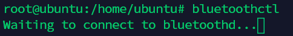
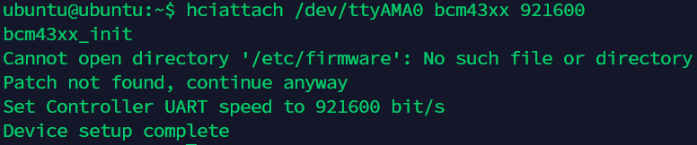
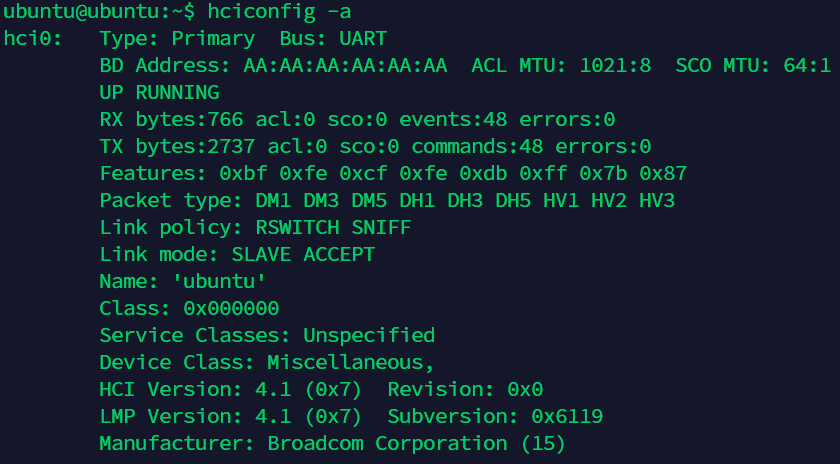
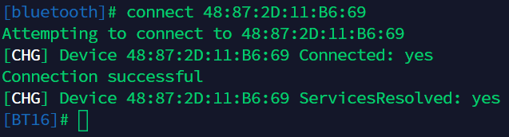
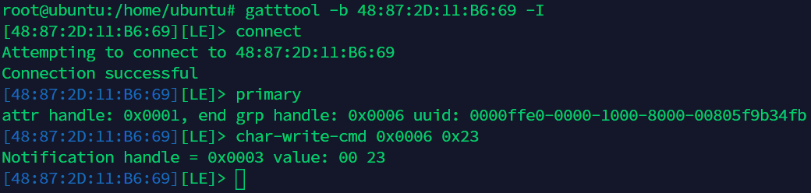
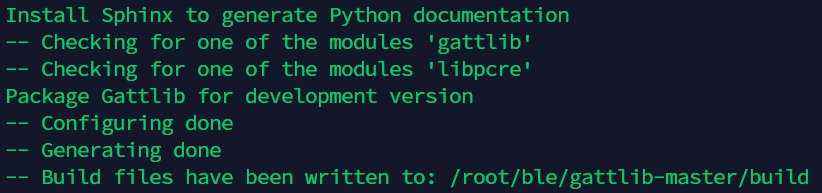
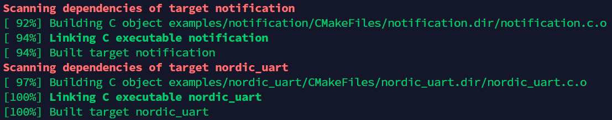
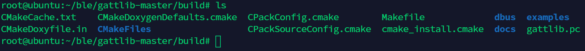

树莓派的蓝牙通讯
==
#### 作者：王浩宇 Qrpucp

## 目录

- [一.准备工作](#1)
- [二.利用蓝牙工具进行调试](#2)
- [三.编译使用gattlib](#3)
  
<span id="1"></span>

## 一.准备工作

我使用的蓝牙模块是大夏龙雀的DX-BT16，支持BLE4.2协议。树莓派的型号为4b，操作系统为64位的ubuntu-18.04。

提前说明一下，因为我没有安装桌面，所以很多工具都需要自己手动安装。

首先先创建一个root用户，方便以后的系列操作。下面的所有命令都是在root权限下进行的。

```shell
sudo passwd
su
```

bluez是linux官方的蓝牙协议栈，我们首先安装bluez。

```shell
apt install bluez
```

树莓派上使用的蓝牙是通过UART和CPU通讯的，所以我们要用```hciattach```建立串口和蓝牙协议层之间的HCI传输接口。

```shell
hciattach /dev/ttyAMA0 bcm43xx 921600
```

如果不建立传输接口就直接使用蓝牙工具，系统就会找不到蓝牙。




在使用```hciattach```初始化蓝牙时，可能我们会接收到以下报错：



我在网上找了一个解决方法，输入以下命令再进行初始化便可以消除报错，不过不管消不消除这个报错，都不影响蓝牙的正常使用。（至少我的使用是这样的）

```shell
mkdir -p /etc/firmware
ln -s /lib/firmware/BCM43430A1.hcd /etc/firmware/BCM43430A1.hcd
systemctl reboot
```

使用```hciattach```初始化之后，我们键入```hciconfig -a```就可以看到我们蓝牙设备了（hci0）。



<span id="2"></span>

## 二.利用蓝牙工具进行调试

接下来就可以使用bluez自带的蓝牙工具进行蓝牙调试了。首先我们使用```bluetoothctl```连接蓝牙并获取地址。

```shell
bluetoothctl
power on
scan on
devices
connect <dev>
disconnect <dev>
exit
```


如果使用传统蓝牙，可能还需要进行配对、输入默认密码等操作。
接下来我们使用```gatttool```的交互模式向蓝牙发送数据，这里需要用到```bluetoothctl```获取的蓝牙地址。

```shell
gatttool -b <dev> -I
connect
```

我们需要用primary命令获取句柄，然后再通过句柄发送数据。

```shell
primary
char-write-cmd <handle> <value>
```


<span id="3"></span>

## 三.编译使用gattlib

用蓝牙工具调试完毕之后，我们可以自己编写代码来进行蓝牙通讯，我的水平不足以直接在协议栈的层面操作，github用户Lab A Part已经将bluez封装成一个个函数了，我是直接调用他编写好的函数进行操作的，github仓库地址如下：https://github.com/labapart/gattlib

首先我们需要在树莓派上重新编译他的代码，这样我们就可以使用他提供的一系列examples。

```shell
cd /home/ubuntu
mkdir ble && cd ble
wget https://github.com/labapart/gattlib/archive/master.zip
apt install unzip
unzip master.zip
cd gattlib-master
mkdir build && cd build
```

安装编译相关的工具和依赖。

```shell
apt install cmake build-essential scons
apt install pkg-config
apt install libbluetooth-dev libreadline-dev
apt install glib-2.0 libglib2.0-dev
apt install doxygen
```

```shell
cmake ..
```



```shell
make
```



下面是编译生成的一系列文件，我们现在就可以使用gattlib提供的例程了，个人认为examples中的```ble_scan```函数比bluez提供的蓝牙工具更加方便。



```shell
cd examples
./ble_scan/ble_scan
./read_write/read_write <...>
```

最后的最后，我们要调用gattlib里的函数编写自己的代码。下面的```test.c```是我自己写的代码。注意，要根据自己设备的架构选择合适的下载地址，我下载的是arm64的库。

```shell
cd /home/ubuntu/ble
wget https://github.com/labapart/gattlib/releases/download/dev/gattlib_0.2-dev_arm64.zip
unzip gattlib_0.2-dev_arm64.zip
wget https://github.com/labapart/gattlib/releases/download/dev/gattlib_0.2-dev_arm64.deb
dpkg -i gattlib_0.2-dev_arm64.deb
apt install libpython3.7
gcc test.c -o test gattlib_0.2-dev_arm64/lib/libgattlib.so
```

**调试蓝牙的过程中遇到的一些坑：**

- 蓝牙无法连接时可以尝试重启蓝牙模块。
- gattlib中的```write```函数会向蓝牙模块连续发送8个十六进制数据，单片机会进入8次串口中断，且```write```函数发送数据是先发送低位，再发送高位。
- 使用gattlib中的函数时也需要先使用```hciattach```初始化蓝牙并赋予```root```权限。

**参考资料：**
https://forums.opensuse.org/showthread.php/523803-Bluetooth-device-not-working-(Raspberry-Pi-3-Leap-42-2)