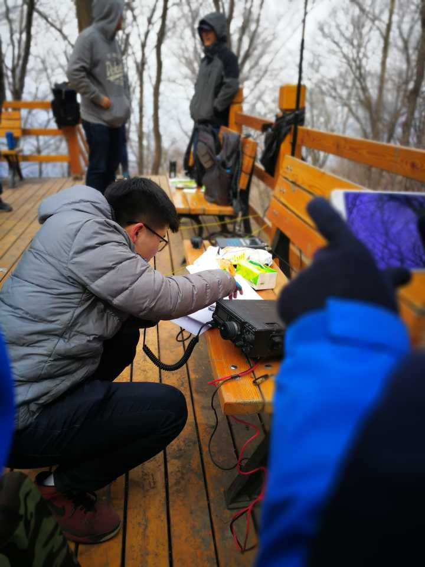

# BY2HIT清明远征架台活动记录

#### 
 写作人：BY2HIT.YJ

## 先介绍下为嘛叫远征

  业余无线电爱好者（也就是HAM）们有各种各样的爱好方向，其中一类喜欢去野外架设无线电台并与其他HAM通联。我们社团也吸收了这项活动并将之固定下来，每年的清明，五一或者暑假都会进行远征架台，既有近的西泉眼水库，也有远的熊瞎子岛和北极村，远征活动除了锻炼技术能力，还能呼吸野外新鲜空气，锻炼身体，可谓一举两得。今年（2018）清明假期进行的远征架台就是这样一个传统的延续。
  
## 远征活动的初章<s>(IC)</s>

  远征开始前紧张的准备和期待略去不表。4月5号上午六点十分左右，远征队员们已经来到了哈尔滨东站的候车室，准备乘坐火车前往目的地。在一段时间的候车之后，队员们全员顺利坐上6：56始发的K7047次列车前往三等站平山站，里程94km，预计于8：20分到达。
  
  在车上，队员们按照小组分配了每组一到两部手台以在到达最终架台地点前保持联系。我们使用的设备可以在非民用波段进行发射，但是为了<b>遵守相关法律法规规定</b>，我们使用了<b>民用频段</b>保持联系，
  U段上下行均为462.425Mhz，亚音103.5hz，V段上下行未144.500Mhz，无亚音。并且使用一台中继在U段与V段间进行转发。保证不同频段间的手台间也能相互通信。<s>用人话说，我们弄了堆对讲机来保证联系（大雾）。</s>然后我们对这些手台之间的连接进行了测试，队员们在频道内进行了愉♂悦的交流。

  由于未知因素，K7047次列车晚点10分钟于8：30分到达平山站。在人员清点之后，我们乘坐包车开始了前往架台地点的路途。

  Introductory Chapter over ~  
  To be continue...

## 远征活动的终章<s>(CC)</s>

  不知作为读者的你有没有注意到，我还没告诉你我们的架台地点是哪里 `#(滑稽)` (手动滑稽)。9时许，包车把我们送到了松峰山的山门处，我们的架台几点也终于尘埃落定，松峰山。

   

  登山，找路，迷路，回到正途，一切都是那么的套路，于是乎，这些都过去了，时间来到了11:30。我们来到了一处木制栈道的平台上，开始了午餐以及本次活动标题里的那两个字“架台”。

  在架台的过程中，三老师和伍亿进行了80%的事情，剩下的人都是给他们打下手的苦力。而他们也在架台的过程中教给我们这些苦力一些架台的经验。向大佬们表示感谢。

  比如三老师说
  >- 在铺设地网的过程中，要按照地网须离地一段距离去放置，但将地网放得足够伸展并且中间不要站人的决定权也是很重要的。  
  >- 而接地什么的，已经无所谓了，因为已经没有必要，去让地网接地了。  

  

  而伍亿则提出
  >- 作人留一线，拔天线时也要在完全拉出后再回塞5cm，这样可以延长天线的使用寿命。  
  >- 同样基于留一线的原理，给自己一些余地，在将天线与馈线组装时，要让天线长度稍短于四分之一波长，再逐渐拉出，使得天线的作用长度达到四分之一波长，此时天线的驻波比最小，最利于信号的发射。 

  

  天线架设成功之后便是通联了(12时许)。我们的收发信机是YAESU-FT897D，天线是14兆波段的GP天线，发射功率为50瓦，在哈尔滨市郊外的松峰山发射(在这里提到设备是因为HAM最开始是为了测试信号的传播效果的，所以会交换双方的天线信息，设备信息，发射功率以及所在位置 //介绍了下ham的一个来源)。之后三老师和伍亿分别上台以CW(等幅波电报，一种电报方法)和SSB(单边带，一种语音调制的方法)方式使用BY2HIT呼号进行了通联，成功与一位俄国HAM，一位日本HAM，以及一位我国河南郑州的HAM通连。

  同时，多数没能帮上忙的队员正在享受包括自热米饭在内的各种午餐，相当于是一次野餐吧。<s>三老师就着冰营养快线啃冷面包的事情我们就不说了。</s>  
  
  
  之后(13时许)，队员们继续未走完的路，在绕了一个圈之后，出了松峰山，回到了平山镇。

  Closing Chapter over ~  
  To be continue...
## 远征活动最终章<s>(Coda)</s>
  <s>由于白学小编被打死，本段无内容</s>

## 远征活动后日谈<s>(MiniAS)</s>
  送上合影一张  
  

  ----
<i>
<front color=lime>
版权声明：

文章均由哈尔滨工业大学业余无线电俱乐部，技术部原创，转载请联系<a href=zhaoyuhao@by2hit.net>BY2HIT技术部</a>
</i>
