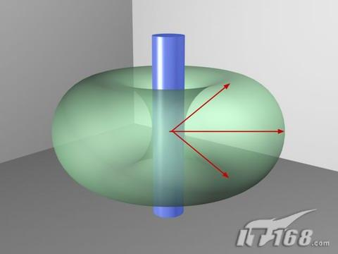
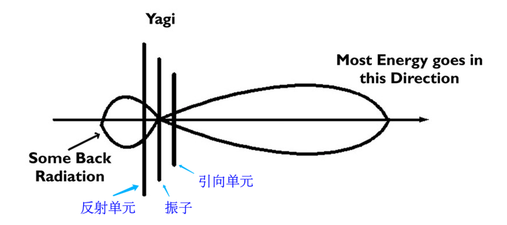

# 天线入门科普--天线的方向性

#### 
 作者：BG2CCF

## 0x00
* 大家在中学的物理课上一定学习过，光是一种电磁波。
* 我们平时说的天线，是用来收发电磁波的。

基于以上两点，我将在这篇文章中通过把天线和灯泡进行对比的方式，来给初学者做一个对天线特性的入门。

> 注：本篇文章仅用作科普，部分内容可能表述不严谨。

## 0x01 最简单的灯泡
* 一个最简单的灯泡💡，可以将四周均匀的照亮。
* 对于最简单的`GP垂直天线`，（也就是一根垂直地面向上的金属线，对讲机用的那种），也可以均匀的向四周辐射电磁波。
* 我们把这种向各个方向辐射电磁波能力相同的天线叫做`全向天线`

下面这张图表示了理想情况下GP天线的`方向图`, `方向图`可以展示出一副天线在三维空间上，向各个方向辐射电磁波的能力。

图片来源:[http://www.fm59.com/zhishi/fushe.htm](http://www.fm59.com/zhishi/fushe.htm)

## 0x02 手电筒
* 相比于最简单的灯泡，手电筒在灯泡的后面加上了抛物面形状的灯罩， 同时在灯泡的前面加上了透镜用于汇聚光线，从而使得灯泡发出的光线有了方向性。
* 处于电磁场中的金属物体会对电磁波的传播产生影响，如果在GP天线的前后各增加一个与其平行的金属棒，则可以把GP天线向四周均匀辐射变为主要向一个方向辐射，如下图所示。
* 电磁辐射能力各向不同的天线，称为`定向天线`

图片来源:[http://www.nutsvolts.com/magazine/article/the_magic_of_antennas](http://www.nutsvolts.com/magazine/article/the_magic_of_antennas)

这里需要注意几点：

* 主动发射电磁波那根金属导体被称为`振子`，另外两根导体被称为`反射器（反射单元）`和`引向器（引向单元）`，一般发射器的长度略长于振子，而引向器的长度略短于振子。
* 振子、反射器、引向器的尺寸、间距都是需要经过理论计算，才能达到最好的导向效果，如果只是随便放两根金属棒，可能引向效果并不好
* 注意到，反射器并不能把所有的电磁辐射都发射到另一侧，仍有一小部分电磁波会向天线后方传播，只是这部分电磁波的功率较小。
* 上图中的天线只有一个引向器，而实际的天线可能会有多达数十个引向器，从而提升其指向性。反射器通常较少，一般只有1~2个。

## 0x03 其他需要了解的
* 上述天线方向图是在理想无限大空间下的理想情况。实际中，脚下的大地，周围的建筑，人体等，都会对天线的方向特性产生影响，使理想方向图发生一定的扭曲
* **天线的发射性和接收特性一般是相同的，如果一个天线在某个特定方向上发射电磁波的能力强，那么这个天线在这个方向上接收微弱信号的能力也就强。**
* 天线的尺寸是和信号的频率有关系的，一般来说，发射或接收信号的频率越高，波长越短，天线的尺寸也就越小。

# 0x04 参考资料及扩展阅读：
* 小巧的天线仿真软件：`MMANA-GAL` 可以用来绘制三维的天线方向图，还能用鼠标拖着旋转观看~
* 专业的天线仿真软件： `CST`, 估计某些同学做毕业设计会用到吧
* 《ARRL 天线手册》
* [yagi\_Antenna](/radio/yagi_Antenna.md)