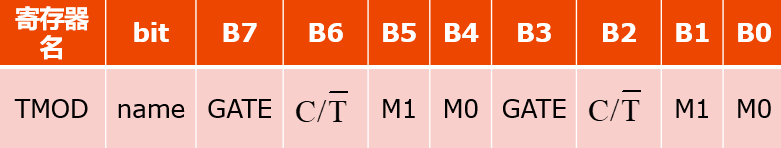

定时器中断
======
撰稿人：陈功
-----
### 理论讲解
晶振为单片机提供了固定的时钟信号。时钟在单片机内部就是一个个的方波信号。晶振的频率有大有小，分频，就是让时钟的频率减慢下来，与之相对的，还有倍频。我们在51中主要讨论分频。  
假设单片机的输入时钟是24MHz，12分频后的频率是则2MHz，分频后对应的周期是0.5us（T=1/f）。  
之前我们的延时主要是利用空循环来浪费时间，此时，CPU不能干其他的事情，效率很低。我们多么希望能有一个东西，不干扰CPU干别的事情，只是默默地计时，等到时间到了指定时间，就跑过来提醒一下CPU该放下手头的事，让灯闪一下了，它就是——定时器（计数器）  
TH0和TL0都是8位的寄存器（理解为变量就好），两个8位的定时器共同组成了一个16位的定时器。
当TL0(LOW)计满0xff（11111111）后，再加1会导致低位溢出，产生的进位将进入到TH0(HIGH)，即TL0每溢出一次，TH0就加 1，当TH0和TL0都是0xff之后再加1，会导致低位的TL0向高位的TH0溢出，但由于高位也已经满了，故高位会再向前溢出，结果，导致TH0和TL0同时回到0x00。  
可以通过编程，使得单片机在TH0/TH1溢出时产生中断。如果我们可以让TH0和TL0以固定的速度加1，那么就可以控制TH0和TL0的溢出速率。换而言之，就是可以控制多长时间让定时器产生一个中断。TH0和TL0每过12个时钟周期便加1，就是说，定时器的计数频率是晶振频率的十二分频。由上文可知，24MHz的频率经过12分频是2MHz，对应的周期是0.5μs。     
 如果想延时5ms，怎么办呢？？？   
很简单！N=t/T=10000次，只需定时器计数10000次，嘻嘻，是不是很容易？  
然而，从0开始的话，10000次根本溢出不了，不是少了（少于65535），就是多了（多于255）。因此，我们需要设定一个初值，好让定时器计数10000次时刚好溢出。为定时5ms，我们需要在第10000次加1的时候溢出，65535-10000+1=55536。55536转换为16进制是0xD8F0（16位），故它的高八位应该是0xD8,低八位应该是0xF0.  
即:TH0=0xD8; 
 &ensp;  &ensp;   TL0=0xF0;  
其实可以在我们的烧录软件中找到定时器计算器，这样计算就很方便了。

#### TMOD寄存器
 
M1=0 M0=1  16位定时器 
M1=1 M0=0  8位自动重装定时器

#### TCON寄存器
TR0和TR1是开启定时器的开关，当TR0=0时，定时器0不计数，TR0=1时定时器才计数。TR1同理。
TF1、TF0、IE1、IE0涉及到中断更深入的东西，之后讲解。 
IT0和IT1~~还记得他们吗？之前使用过，现在知道他们的出处了吧
TCON是可以位寻址的，故可以直接写类似TR0=1  
  

>TH0=0xB1;//初值的高位  
TL0=0xE0;//初值的低位  
TMOD=0x01;//16位计时器  
EA=1;//开启总中断  
ET0=1;//开启定时器中断  
TR0=1;//启动定时器  
>
现在，让我们通过中断来实现每隔1秒，让不同位数码管亮起的效果。  
在这里新添加一个变量t，同时可以删除Delay500ms这个函数，本程序中不使用该函数。
并且删除掉原来while循环中的其他语句，只保留while(1);(注意while(1);后面有分号)  
> unsigned int t=0,i=0;  
     void main()  
      {  
           timer0_init();  
           while(1)；  
            }
>
下面要写中断服务函数啦，定时器0对应的是interrupt1。  
#### 定时器0的中断服务程序
> void T0_Service() interrupt 1  
{  
    	t++;  
        if(t==100)  
        {  
        t=0;  
        P0=P0>>1;  
        i++;  
        if(i==4)  
		{  
        	i=0;  
            P0=0x08;
		}  
        }
}
>
注：由于定时器的TH0和TL0计满也不能到1000ms，所以我们另外增加一个计数器 t，每隔10ms则t加1，t加满100则认为计满了1000ms。 
因此就是这样一个结构: 
>unsigned int t=0,i=0; 
void main() 
{ 
	 void timer0_init()； 
	while(1); 
} 
void T0_Service() interrupt 1 
{ 
}
>
运行程序，大家应该会发现，确实在计数，但是……计数貌似很慢啊，完全不是我们预想的1秒钟啊……
问题出在哪里呢？ 
我们在初始化定时器参数的时候写了TH0=0xB1，TL0=0xE0，目的是让计数到达20000次（即10ms）时产生中断 
但是，在第一次产生中断之后，TH0和TL0由于溢出，均已变为0 
所以，第二次及以后的每一次计数都是从0开始计数的，直到计数达到65536次之后才产生下一次中断，而不是我们预想的20000次 
所以，要在中断服务程序中重新填充TH0和TL0。 
重装一般写在中断处理程序的开头。如果把重装写在中断处理函数的结尾，那么要等到整个中断处理函数执行完之后才进行重装，执行中断处理函数的时间将被累加到计时的时间中，造成误差。
#### 8位自动重装模式
当把定时器选择为8位自动重装时，定时器只有TL0参与计数 
当TL0发生溢出时，单片机通过硬件把TH0中的数值复制到TL0中，这个操作几乎是瞬间完成的。 
这样，TL0马上就可以由新装入的初值开始计数，而不是从溢出后的0开始计数，精度大大提高。 
但是，定时器由16位缩减到8位，最大的定时时间会缩短。 
将TMOD修改为0x02，这样就设置了定时器工作在8位自动重装模式下 
由于此时计数最大只能计到255，我们不妨让定时器每计250个数便产生一次溢出，也就是每隔

250×0.5μs=125μs

产生一次溢出。在这个设定下，计满1秒钟需要溢出8000次   
定时器初值应该设置为：

255-250+1=6
  
由于现在要累计满8000次，故t需要改变为int型。 
在中断处理中，删除有关重装的两行程序，同时修改t的计数值为8000。    
#### 把定时器变成计数器  
从前面的介绍可以看出，定时器之所以能够定时，是因为它可以按照固定的速度来计数，所以从本质来说，定时器本身是一个计数器。

那么，如果把TH0和TL0的计时脉冲输入从晶振时钟信号改为某个引脚，是不是就可以对这个引脚上的高低电平变化计数了呢？	 	 

 说了这么多，小可爱们可能已经有些乱了，不用担心，我们提供了修改完成之后的代码，小可爱们可以直接烧进单片机里，结合代码再复习一下也不错哦？   
 

## 实用代码
 
>#include<stc12c5a.h>  
sbit led=P3^6; 
void init(); 
unsigned int t=0; 
 
void main() 
&ensp;{ 
 &ensp; init(); 
&ensp;	while(1);
&ensp; }  
void init() 
{ 
&ensp;	TH0=0X06;
 &ensp;	TL0=0X06;
 &ensp;	TMOD=0X02;
 &ensp;	EA=1;
  &ensp; ET0=1;
 &ensp;	TR0=1;
} &ensp; 
void service() interrupt 1 
{
 &ensp;t++;
 &ensp;	if(t>8000)
 &ensp;	{
 &ensp;	led=~led;
 &ensp;	t=0;
 &ensp;	}
> }